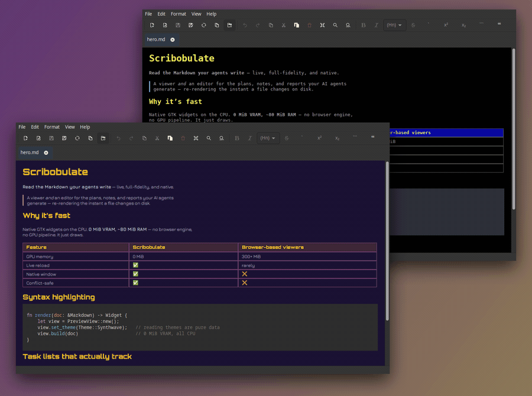

# Scribobulate

A multi-platform native Markdown viewer and editor for **Linux**, **macOS**, and **Windows** —
for the documents AI agents generate: rendering full-fidelity Markdown on the CPU
with effectively zero GPU memory (leaving room for those hungry Ollama models), and live-reloading files the instant an agent
changes them on disk.

<picture>
  <source srcset="assets/splash.webp" type="image/webp">
  
</picture>


> **Status: early but capable.** Rendering, the editing pane (with live
> split-preview), live reload, and conflict handling all work today —
> Scribobulate opens and displays full-fidelity Markdown (tables,
> syntax-highlighted code, task lists, images) at 0 MiB VRAM / ~80 MiB RAM as a
> single-instance multi-window, multi-tab app, reloads files as they change on disk, and
> when a change lands under unsaved edits it prompts you to reload or keep your
> work (a clean change reloads silently with a brief notice). Unsaved edits also
> survive the application dying: they are snapshotted as you type and offered back
> on the next launch.

## What it does

Scribobulate is built for working alongside AI agents that rewrite Markdown
continuously: it watches the open file and re-renders automatically the moment an
agent changes it, so the plans, notes, and reports your agents produce are always
shown up to date. It displays your Markdown the way you expect — headings,
tables, syntax-highlighted code, task lists, and images — in a fast native GTK
window, with an optional editing pane and live preview. When a file changes
underneath unsaved edits, Scribobulate asks you what to do instead of silently
discarding your work — and if the application itself dies, your unsaved work is
waiting for you when you reopen it.

> *One thing we're both very proud of is using Scribobulate to improve Scribobulate!*
> -- *MadMartian*

## Features

*(Shortcuts below are shown in Linux/Windows form. On macOS, Ctrl becomes ⌘ —
see Help ▸ Keyboard Shortcuts in the app for the exact mapping.)*

- **Light on your machine** — native rendering on the CPU, not a browser engine.
  Leaves GPU memory free for the models and tools you actually care about.
- **Live reload** — when an agent (or anything else) rewrites an open file, the
  preview updates immediately and your place in the document is kept.
- **Your edits stay yours**
  - **Conflicts** — if a file changes while you have unsaved work, you're asked
    whether to reload or keep your version. Never a silent overwrite.
  - **Crash recovery** — unsaved edits come back after a crash, still marked
    unsaved, with the choice to keep or discard. Your file is never written
    without an explicit save.
  - **Rename in place** — F2, or right-click the tab, renames the file a tab is
    reading without leaving the app. Same folder, name only; every surface
    follows at once and nothing is re-read.
- **Full-fidelity Markdown**
  - Tables, syntax-highlighted code, images, and task-list checkboxes
  - Hover a code block for a copy button — one click puts the code on the
    clipboard, fences and all container markers left behind
  - Clickable links with a hover preview of the destination
  - Follow a link to another Markdown file and it opens as a tab — read a
    whole document set without hunting files by hand
- **Edit with a live preview**
  - Split view, editor-only, or preview-only
  - Format toolbar and shortcuts for bold, italic, headings, lists, quotes,
    code, task lists, and more
  - Lists and quotes continue as you type; fenced code blocks close themselves
- **Annotate in the file** — select a claim, leave a comment, and it is saved
  *in* the Markdown as portable markup the author (or the next agent) can read
  inline. No side channel, no extra tool.
  - Margin markers to open, edit, or remove a comment
  - Annotations sidebar lists every comment in the document (F8)
  - Walk the comments from the keyboard, without hunting for margin markers
    (Ctrl+Alt+N / Ctrl+Alt+P)
- **Take the document with you** — File ▸ Export writes what you are reading as
  a standalone **HTML** file to share or a paginated **PDF** to keep. Images
  travel inside the file, so it still works after you send it; your annotations
  come along, and the reading theme you chose is what the artefact looks like.
- **Find what you need**
  - Search the whole document, including table cells (Ctrl+F)
  - Replace in edit and split modes (Ctrl+H)
  - Outline sidebar jumps to any heading (F9)
- **Comfortable reading**
  - Reading themes: **Sepia**, **Bedtime**, **Synthwave**, **Terminal**,
    **Candy**, or match your desktop (**System**)
  - Zoom the preview from 50% to 300% — remembered across sessions
  - Arrange the split any way you like (left/right or top/bottom)
- **Tabs and windows that stay out of the way**
  - Several documents per window; drag tabs to reorder, between windows, or
    out to a new window
  - One process for the whole session — open more files without spawning more apps
  - Back and Forward through the documents you have been reading — and the
    sections within them, so following a table-of-contents link is a step you can
    take back — on the keys and mouse buttons your browser uses (Alt+←/→, or the
    thumb switches)
  - Session restore brings back windows, tabs, zoom, split, and sidebars
- **Safe by default**
  - Links and images stay inside the document's folder unless you opt in
  - Remote images are off until you enable them for documents you trust
- **Familiar desktop app** — native menus, toolbar, keyboard shortcuts, and
  in-app help (F1 for the shortcut list)

## Quickstart

### Linux

Install the package — no Rust toolchain, no development libraries:

```bash
sudo apt install ./scribobulate_0.1.0_amd64.deb     # Debian, Ubuntu
sudo dnf install ./scribobulate-0.1.0-1.x86_64.rpm  # Fedora, RHEL
```

Or build from source, which is what you want if you intend to change it:

```bash
sudo apt-get install -y libgtk-4-dev libgtksourceview-5-dev
cargo build --release
./target/release/scribobulate path/to/document.md
```

To build the packages yourself, `packaging/linux/build-deb.sh` and
`build-rpm.sh` (the latter needs `rpm` installed on a Debian host). Both take the
version from `Cargo.toml` and install the same payload.

### macOS

Install the Homebrew GTK dependencies first — skipping this is the most common
build failure (`pkg-config` can't find `gtk4`/`cairo`/`pango`/etc.):

```bash
brew install gtk4 gtksourceview5 adwaita-icon-theme
```

Then build and package:

```bash
cargo build --release
packaging/macos/bundle.sh          # -> target/macos/Scribobulate.app
open target/macos/Scribobulate.app --args path/to/document.md
```

Or `packaging/macos/install.sh` to also get a `scribobulate` command on PATH
(symlinked into Homebrew's `bin/`, so it needs no `sudo`):

```bash
packaging/macos/install.sh
scribobulate path/to/document.md
```

Not a self-contained redistributable — the built app still links these
Homebrew libraries at runtime. More: [`packaging/macos/README.md`](packaging/macos/README.md).

### Windows

Run the installer (`Scribobulate-<version>-x64-setup.exe`) — per-user, no admin
prompt, runtime included. Building from source:
[`packaging/windows/README.md`](packaging/windows/README.md).

### Tips (all platforms)

A second launch reuses the running process. To force a **separate** instance
(e.g. a dev build beside your everyday one), pass `--new-instance` (`-n`):

```bash
./target/release/scribobulate -n path/to/document.md
```

Logging uses `RUST_LOG` (app and GTK/GLib share one sink):

```bash
RUST_LOG=warn ./target/release/scribobulate            # default
RUST_LOG=info,scribobulate=debug ./target/release/scribobulate
```

Unsaved work survives a crash: snapshots restore on the next launch with
**Keep** or **Discard recovery**. Your own files are never written without an
explicit save. Crash reports land in your state directory
(`~/.local/state/scribobulate/` or `%LOCALAPPDATA%\scribobulate\`) and do not
include document text — safe to attach to a bug report.

## Documentation

Detailed documentation lives in the `sdd/` directory:

- `sdd/PRODUCT.md` — Product definition and rationale
- `sdd/TECH.md` — Technical architecture and system diagram
- `sdd/TDD.md` — Test specifications (Given/When/Then rubrics)
- `sdd/POLICY.md` — Development rules and constraints
- `sdd/ANTI-PATTERNS.md` — Why the native-widget stack was chosen
- `sdd/ISSUES.md` — Known issues

## License

Apache License, Version 2.0 — see [LICENSE](LICENSE) for the full text.
