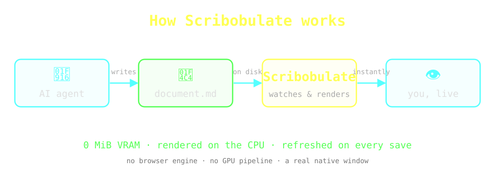

# How Scribobulate Works

Scribobulate sits quietly between the agents that **write** Markdown and the
person who has to **read** it — turning a file on disk into a live, native page.

## The loop, in three beats

- **Watch** — a file monitor follows the open document; no polling, no refresh button.
- **Render** — the instant the bytes change, the preview rebuilds on the CPU.
- **Preserve** — your scroll position and reading theme survive every reload.

> It just draws. `0 MiB` of video memory, a real window, and your document —
> always current.
