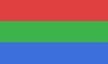

# Reading Theme Surface Sweep

One document carrying **every surface a reading theme must reach** (TDD §18.4).
If any element below still shows a desktop-theme colour on a warm page — a white
slab, a blue bar, a grey island — that is the defect this fixture exists to catch.

Body prose with an [external link](https://example.com), some `inline code`,
**bold**, *italic*, ~~strikethrough~~, and super/subscript: E=mc^2^ and H~2~O.

## Heading 2 — check the hierarchy scales

### Heading 3

#### Heading 4

##### Heading 5 (h6 folds onto this — the deepest rendered tier, by design)

> A blockquote: its **accent bar** must follow the theme, not the system accent.
> It contains a [link](https://example.com) and `code`, both themed.
>
> - a quoted list item — must sit INSIDE the quote's bar
> - another quoted item
>   - nested one level deeper

Unordered, ordered and task lists — markers are drawn in a gutter, so check each
marker stays beside **its own** text at every depth (ScrAP-121):

- bullet one
- bullet two with enough text that it wraps around onto a second visual line to
  confirm the continuation aligns under the item text, not under the marker
  - nested bullet

1. ordered one
2. ordered two
9. nine — check the period alignment against
10. ten (two digits, right-aligned on the `.`)

- [ ] an unchecked task
- [x] a checked task

A fenced block — the panel fill and the token colours both follow the theme:

```rust
fn main() {
    let greeting = "syntax highlighted";
    println!("{greeting}");
}
```

A table — cells are `GtkLabel`s outside the buffer, so they need a second
application path for every colour (ScrAP-36). Borders, header fill, and the text
inside must all be themed:

| Header A | Header B | Header C |
|----------|----------|----------|
| cell one | **bold** in a cell | a [link](https://example.com) |
| cell two | `code` in a cell | the word flat appears here |

An inline image (its selection tint is themed — drag-select over it):



A horizontal rule follows — it is a stock `GtkSeparator`, the one anchored widget
the app does not build itself, and so the surface most likely to stay
system-coloured:

---

An annotation: {==an annotated claim==}{>>the comment on that claim<<} — its
highlight must stay clearly visible on a warm page, and must match the
highlight on the same word inside a table cell above.

The word flat appears here too, and again: flat. Use Find (Ctrl+F) on "flat" to
check the find highlights — body and table cell — against the theme.
